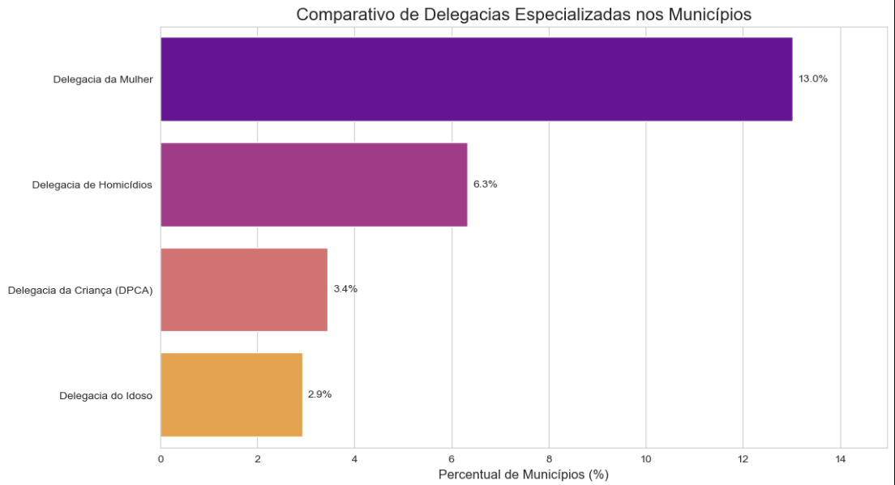
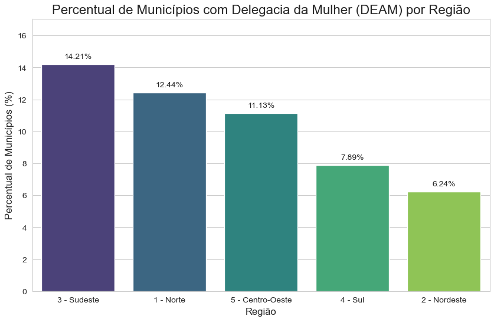
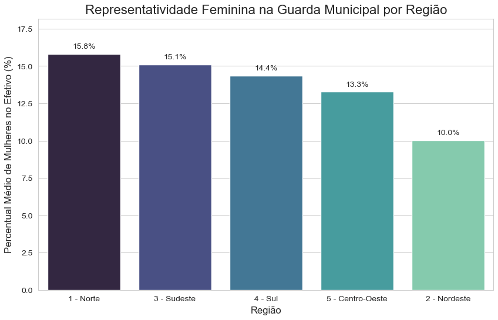

# Análise da Estrutura de Segurança Pública para Mulheres no Brasil (MUNIC 2023)

## 📖 Descrição do Projeto
Este projeto realiza uma análise descritiva dos dados da Pesquisa de Informações Básicas Municipais (MUNIC) de 2023, com foco nas estruturas de segurança pública voltadas para as mulheres nos municípios brasileiros. O objetivo é visualizar e comparar a distribuição de recursos como Delegacias Especializadas (DEAMs) e a representatividade feminina na Guarda Municipal.

## 📊 Principais Análises e Resultados
As principais conclusões da análise foram:

* **Comparativo de Delegacias:** A Delegacia da Mulher é a estrutura especializada com maior cobertura percentual, presente em cerca de 14% dos municípios que forneceram informações válidas.
    

* **Cobertura Regional de DEAMs:** A região Sudeste lidera em cobertura proporcional de DEAMs, enquanto a região Nordeste apresenta a menor cobertura.
    

* **Representatividade Feminina na Guarda Municipal:** A região Norte se destaca com a maior média de mulheres no efetivo das Guardas Municipais (15.8%), mostrando que a representatividade feminina não segue o mesmo padrão regional da infraestrutura de delegacias.
    

## 🛠️ Ferramentas Utilizadas
* **Pré-processamento e Limpeza:** Microsoft Excel
* **Linguagem:** Python
* **Bibliotecas:** Pandas (para manipulação de dados), Matplotlib e Seaborn (para visualização)
* **Ambiente:** Jupyter Notebook

  
## 🗂️ Fonte dos Dados
Os dados utilizados foram extraídos da **Pesquisa de Informações Básicas Municipais (MUNIC) de 2023**, disponibilizada pelo Instituto Brasileiro de Geografia e Estatística (IBGE).
